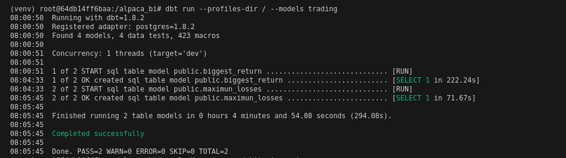
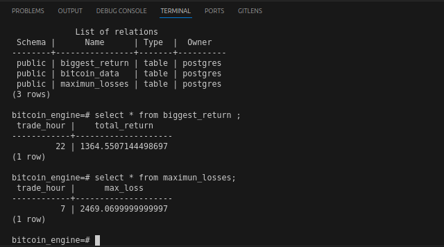

# Alpaca

## Docker Image
In this step, we will accomplish the following tasks:

1. Initialize the PostgreSQL service and install the necessary dependencies.
2. Create the database and the table to store the data.
3. Download the data from Kaggle and unzip it.
4. Copy the CSV file into the created table. <strong>Please note that this data copying process may take approximately 10 minutes due to the large number of rows being transferred. <strong>


Inicialize the docker service
```bash
sudo systemctl start docker
sudo systemctl enable docker
```

Build the image
```bash
docker build -t bitcoin_engine .
```

Create network
```bash
docker network create alpaca_network
```

Run container
```bash
docker stop alpaca_engine # in case you need to re build and need to stop the previous container
docker rm alpaca_engine 
docker run --name alpaca_engine -e POSTGRES_PASSWORD=admin -d -p 5432:5432 bitcoin_engine
```

Insert bitcoin data
```bash
docker exec -it alpaca_engine psql -U postgres -d bitcoin_engine -f /usr/src/app/queries/load_bitcoin_data.sql
```


[Optional] Run de script manually - it usually take some minutes to download the data from kaggle and extract it
```bash
docker exec -it alpaca_engine /bin/bash -c "source /usr/src/app/venv/bin/activate && python3 /usr/src/app/scripts/extract_file.py"
```

Debug logs
```bash
docker logs alpaca_engine
```

Activate venv
```bash
docker exec -it alpaca_engine bash
source /usr/src/app/venv/bin/activate
dbt --version
```


## Run dbt commands

Dbt debug
```bash
docker exec -it alpaca_engine bash
source /usr/src/app/venv/bin/activate
cd alpaca_bi
dbt debug --profiles-dir /
```


Dbt run
```bash
docker exec -it alpaca_engine bash
source /usr/src/app/venv/bin/activate
cd alpaca_bi
dbt run --profiles-dir / # we specify the path of the profiles.yml file 
```


Run SQL query on the dbt models to answer the prompt questions
```bash
docker exec -it alpaca_engine bash
source /usr/src/app/venv/bin/activate
cd alpaca_bi
dbt run --profiles-dir / --models trading
```



## Check results in Postgres

Open postgres terminal in interactivate mode
```bash
docker exec -it alpaca_engine psql -U postgres -d bitcoin_engine
```

Inside the terminal let's check if the table were created in our postgres database
```bash
psql -U postgres -d bitcoin_engine
\dt
```

Now let's answer the question 1:
```bash
select * from biggest_return ; # at 22:00
``` 

Finally, lets answer question 2:
```bash
select * from maximun_losses; ; # at 7:00
```

After running dbt, our tables have been successfully created and are ready to answer the questions, as shown in the image below:

